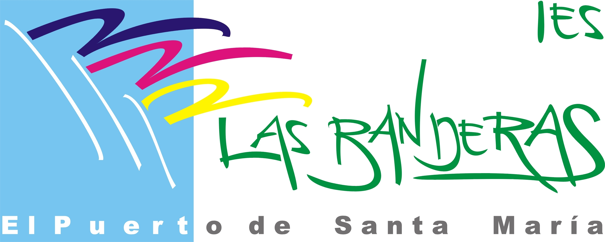

# IA en el aula: Innovando la Educación del futuro

  

Repositorio para alojar los materiales  de la formación en "IA en el aula: Innovando la Educación del futuro" de formación", del Grupo de Trabajo del IES Las Banderas durante el mes de abril del 2024.

Duración de la formación: 1 sesión de 3 horas en modalidad presencial

## Descripción de la la Actividad

El objetivo principal es explorar la integración de la IA en el ámbito educativo, y para ello hemos diseñado una actividad práctica que se desglosa en los sigiuientes apartados.

- **Fundamentos y Aplicaciones de la IA Generativa**: Explora cómo la IA genera contenido y amplía posibilidades educativas, desde texto a 3D.

- **Diseño de Situaciones de Aprendizaje con IA**: Aprende a crear actividades educativas enriquecidas con modelos de lenguaje para un aprendizaje interactivo.

- **Potenciando la Productividad Docente con IA**: Descubre cómo diferentes modelos de IA optimizan tareas docentes, desde la planificación hasta la evaluación.

## Materiales de la Actividad

* [Presentación](https://0xmrivas.github.io/formacion-profesorado-IA-IES-las-banderas/slides/)
* [Referencias](https://0xmrivas.github.io/formacion-profesorado-IA-IES-las-banderas/referencias/)
